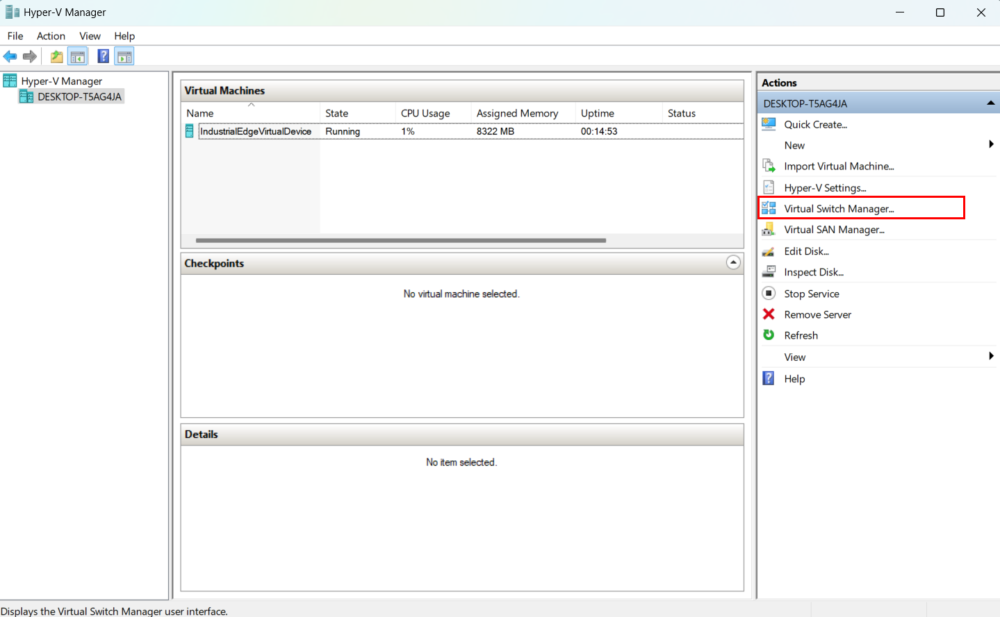
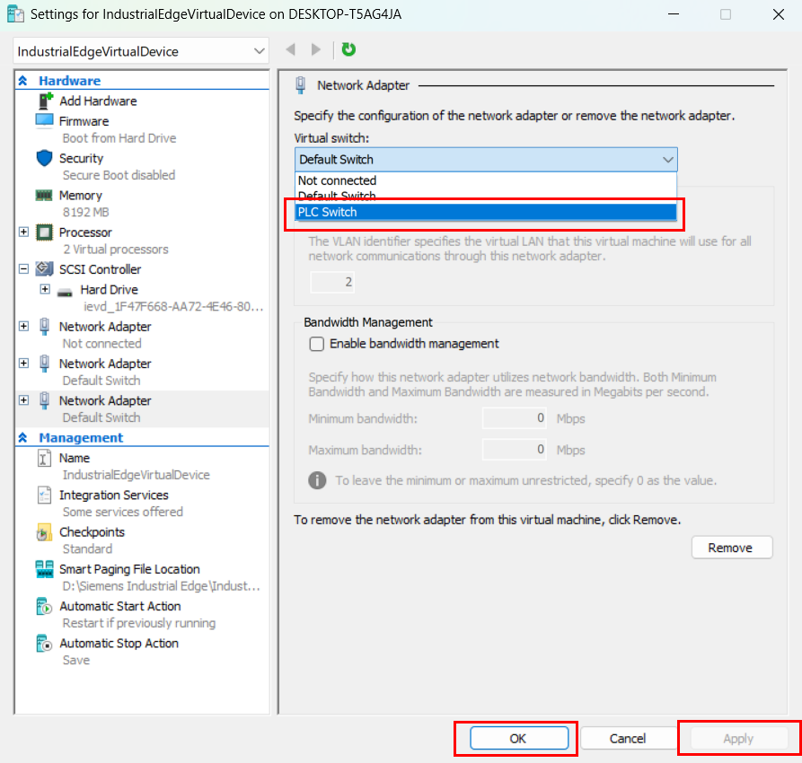

# Virtual Switch Configuration Guide

This guide demonstrates the steps for configuring virtual switches and network adapters.

## Step 1: Virtual Switch Manager

First, open the Virtual Switch Manager to begin configuration.

## Step 2: Hyper-V Landing Page

Navigate to the Hyper-V landing page to access your virtual machines.

## Step 3: Create External Switch

Create a new external switch for network connectivity.

## Step 4: Configure Switch Settings

Configure the switch settings with the marked options.

## Step 5: Warning Message

You may see a warning message during configuration. Review it carefully.

## Step 6: Select Virtual Machine

Select the virtual machine where you want to apply the network adapter.

## Step 7: Apply Network Adapter

Apply the created network adapter to your virtual machine.

## Step 8: Edit VM Settings

Edit the virtual machine settings as needed.

## Step 9: Check Configuration

Verify your configuration settings are correct.

## Step 10: Deploy

Finally, deploy your configuration changes.

