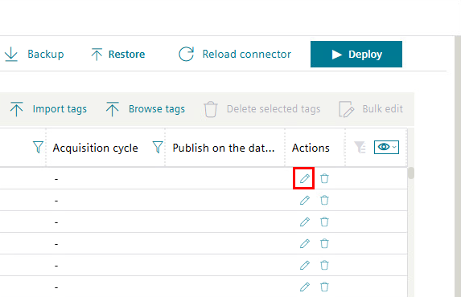
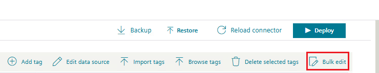
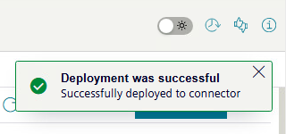

# Tag Configuration Guide

This guide shows how to configure and edit tags in your system.

## Editing Tags

You can edit tags to modify their properties and settings.

## OPC UA Tag Configuration

Configure OPC UA specific tag settings for industrial communication.

## User Management

Add users to your system for access control.

## Bulk Operations

Use bulk edit functionality to modify multiple items at once.

## Deployment Status

Check the deployment status to confirm successful changes.

