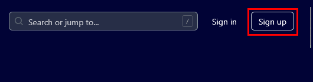
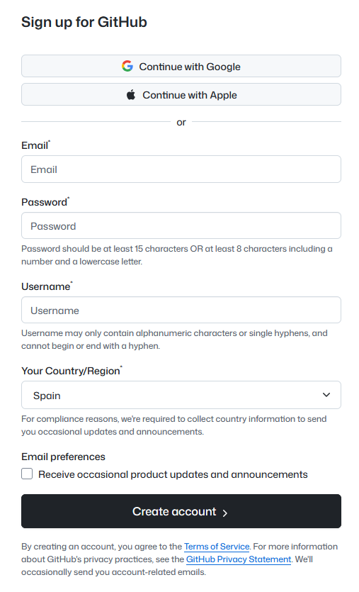
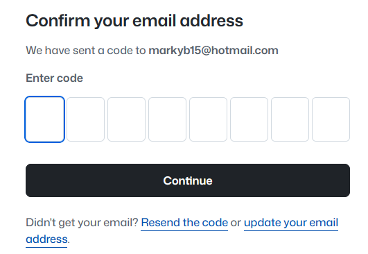
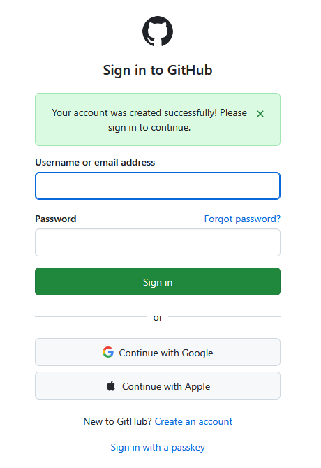
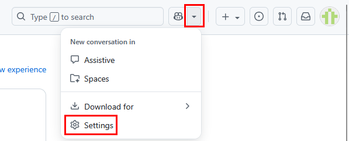
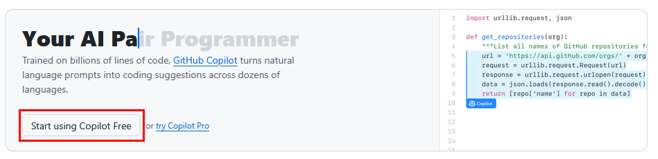
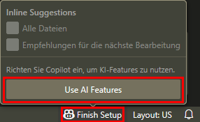

# Erste Schritte mit den Beispieldateien

## Ein GitHub-Konto erstellen

> **HINWEIS:**  
> Wenn Sie schon ein GitHub-Konto haben, können Sie zum [nächsten Schritt springen](#mit-ihrem-github-konto-einloggen).

1. Öffnen Sie <https://github.com/> in einem Browser Ihrer Wahl.
2. Klicken Sie oben rechts auf "Sign Up".

    

3. Füllen Sie das Formular entsprechend aus.

    -Oder-

    Verwenden Sie Ihr Apple- oder Google-Konto.

    

    Sie erhalten eine E-Mail mit einem Verifikationscode.

4. Geben Sie den Code ein, um Ihre E-Mail-Adresse zu bestätigen.

    

    Ihre E-Mail-Adresse wird bestätigt.

## Mit Ihrem GitHub-Konto einloggen

1. Wenn Sie gerade ein neues Konto erstellt haben, werden Sie direkt zur Login-Seite weitergeleitet. Wenn Sie schon ein Konto haben, klicken Sie oben rechts auf "Sign In".

2. Geben Sie Ihren Benutzername und Ihr Passwort ein und klicken Sie auf "Sign In".

    

    Sie sind jetzt eingeloggt.

## GitHub Copilot einrichten

1. Klicken Sie auf das Pfeilsymbol neben dem Copilot-Symbol und wählen Sie "Settings".

    

2. Klicken Sie auf "Start using Copilot free".

    

    Ein Chat-Fenster mit Copilot öffnet sich. Das Fenster wird für diesen Kurs nicht gebraucht.

3. Gehen Sie zurück zum Repository mit den Beispiel-Dateien: <https://github.com/mark-blundell-tanner/example-files-tae>.

## Einen Codespace erstellen

1. Klicken Sie auf "Code" > "Codespaces" > "Create codespace on main".

    Ein Codespace startet in einem neuen Tab. Dies kann einige Minuten dauern.

2. Wenn der Codespace fertig gestartet ist, klicken Sie unten rechts auf das Copilot-Symbol und klicken Sie auf "Use AI Features".

    

    Der Codespace ist erstellt und Copilot ist eingerichtet.

## Ergebnis

Sie haben alles für den praktischen Teil des Kurses vorbereitet.
